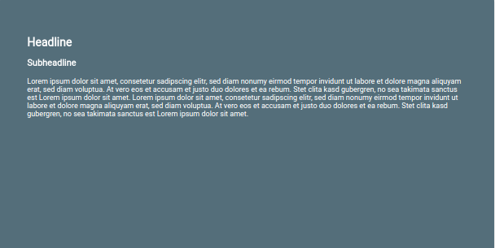
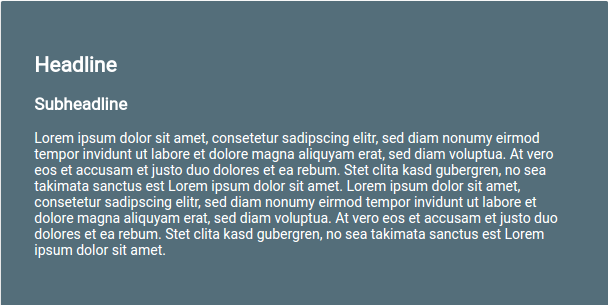

# text-fitter

[](https://badge.fury.io/js/text-fitter) [](https://travis-ci.org/salomonelli/text-fitter)


## Quickstart

Install the package with

```
npm install text-fitter --save
```

<details>
  <summary>ES7</summary>

```javascript
import {fix} from 'text-fitter';
const element = document.getElementById('any-id');
fix(element);
```
</details>

<details>
  <summary>Vanilla JS</summary>

```html
<script type="text/javascript" src="dist/javascript.js"></script>
<script>
window.onload = function() {
  var element = document.getElementById('any-id');
  TextFitter.fix(element);
};
</script>
```
</details>


### Enlarge font to fit

 

To automatically enlarge the font to fit the element do the following:
```javascript
fix(element, true);
```

The second parameter is optional and is set by default to false.
